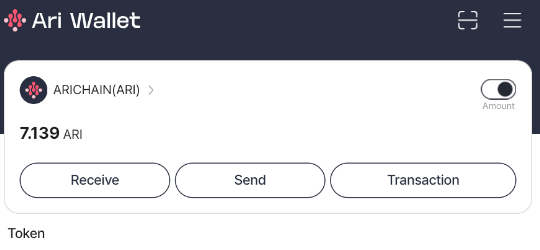
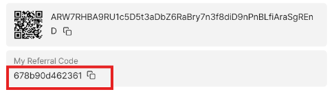

# Arichain Auto referral


- website : https://arichain.io/
## Features

- **Auto Register**
- **Auto Save Accounts**
- **Support Proxy usage**

## Prerequisites

- Node.js installed on your machine
- Arichain invite code : 
- download apk first in google playstore [arichain.app.ari.wallet](https://play.google.com/store/apps/details?id=arichain.app.ari.wallet)

- copy your referral code 

    

- if you need invite code for register you can use mine: 
    ```
    678b90d462361
    ```

## Installation

1. Clone the repository:
    ```sh
    git clone https://github.com/Zlkcyber/arichain.git
    cd arichain
    ```

2. Install the required dependencies:
    ```sh
    npm install
    ```
3. optionally you can use proxy: 
- paste proxy in `proxy.txt` format `http://username:password@ip:port` 
    ```sh
    nano proxy.txt
    ```
4. Run the script:
    ```sh
    npm run start
    ```

## All accounts information saved at `accounts.txt`


## 

This project is licensed under the [MIT License](LICENSE).